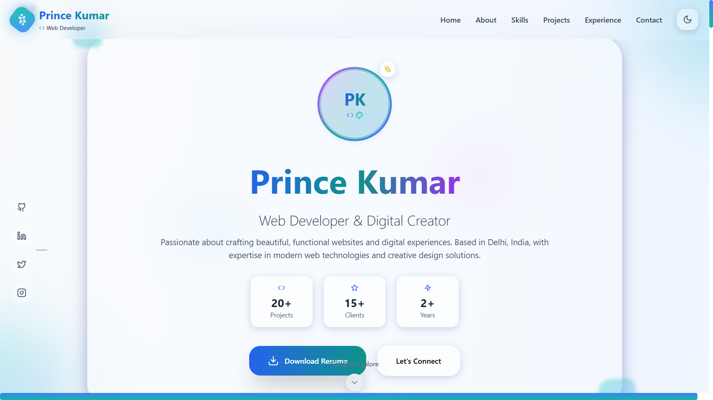

# 🌐 Liquid Glass Portfolio

A modern, interactive, and glassmorphic developer portfolio website. Built with **React.js** and **Tailwind CSS**, it showcases your work, skills, and online presence with a sleek design and smooth animations.

 <!-- Replace with actual screenshot if available -->

## 🚀 Live Demo

👉 [Visit the Website](https://liquid-glass-portfolio.netlify.app/)

---

## 🛠️ Tech Stack

- **Framework:** React.js (Vite)
- **Styling:** Tailwind CSS
- **Animation:** Framer Motion
- **Deployment:** Netlify
- **Version Control:** Git & GitHub

---

## 📁 Project Structure

```
project/
├── public/
│   └── ...static assets
├── src/
│   ├── assets/        # Images and icons
│   ├── components/    # Reusable components (Navbar, Footer, etc.)
│   ├── pages/         # Individual sections like About, Projects, Contact
│   ├── App.jsx        # Root app file
│   ├── main.jsx       # Entry point
│   └── index.css      # Tailwind CSS config
├── tailwind.config.js
├── vite.config.ts
└── README.md
```

---

## ✨ Features

- 🧊 **Glassmorphism UI** – Stylish, frosted-glass interface
- ⚡ **Fast Performance** – Powered by Vite and optimized assets
- 📱 **Responsive Design** – Works on all devices
- 💼 **Projects Showcase** – Display your best work with GitHub links
- 📇 **Contact Section** – Visitors can connect with you easily
- 🌙 **Dark Mode Ready** *(Optional)*
- 🔧 **Easy to Customize** – Just edit the content in `src/pages/`

---

## 📸 Screenshots

| Hero Section | Projects Section | Contact Section |
|--------------|------------------|-----------------|
|  |  |  |

> _Make sure to update these image links with actual hosted screenshot URLs or local paths._

---

## 🧑‍💻 Getting Started

### 1. Clone the Repo

```bash
git clone https://github.com/prince-m2hgamerz/liquid-glass-portfolio.git
cd liquid-glass-portfolio
```

### 2. Install Dependencies

```bash
npm install
```

### 3. Run Locally

```bash
npm run dev
```

> Open `http://localhost:5173` to view it in your browser.

---

## ⚙️ Customization

- Update content in the `src/pages/` and `components/` folders.
- Add your own images inside `src/assets/`
- Modify colors/fonts in `tailwind.config.js`

---

## 🪄 Deployment

The site is deployed on **Netlify**. To deploy:

1. Push your code to GitHub
2. Link your GitHub repo to Netlify
3. Set build command: `npm run build`
4. Set publish directory: `dist/`

---

## 🙌 Acknowledgements

- [React.js](https://reactjs.org/)
- [Tailwind CSS](https://tailwindcss.com/)
- [Framer Motion](https://www.framer.com/motion/)
- [Heroicons](https://heroicons.com/)
- [Netlify](https://netlify.com/)

---

## 📄 License

This project is licensed under the [MIT License](LICENSE).

---

## 🧑 Author

**Prince (M2H Gamerz)**  
💼 [GitHub](https://github.com/prince-m2hgamerz)  
🌐 [Portfolio](https://liquid-glass-portfolio.netlify.app/)

---
